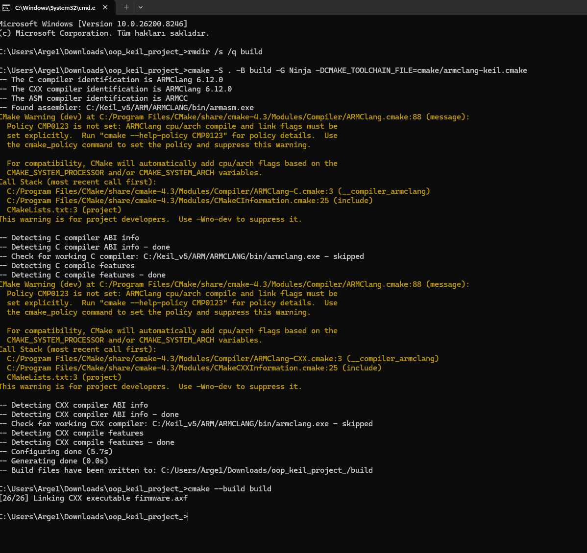

# Realtime Industrial Sensor (STM32, Bare-Metal, C++)

This project implements a real-time industrial temperature and humidity monitoring system on an STM32F4 microcontroller. The firmware is written in modern C++ using a layered architecture and runs without an RTOS by default.

## Overview

The system collects sensor data via I2C, processes it deterministically, and exposes it over Modbus RTU over RS485 for integration with industrial monitoring systems such as SCADA.

## Features

- Register-level peripheral drivers for I2C, UART, ADC, DMA and PWM
- Modbus RTU protocol implementation over RS485
- SHT3x temperature and humidity sensor integration
- Deterministic main loop timing using cycle counting
- Flash-based configuration storage with CRC validation
- Watchdog-based fault detection and recovery
- Layered and maintainable C++ architecture
- CMake-based build system using ARMClang / Keil toolchain
- Optional FreeRTOS integration path for production task separation

## System Architecture

The project is organized into modular layers to improve maintainability and scalability:

- App: Application entry point and orchestration
- Services: Business logic such as sensor handling, Modbus, watchdog and flash services
- Drivers: Hardware abstraction and peripheral control
- Legacy: Low-level drivers kept for compatibility
- Config: Configuration structures and APIs
- Common: Shared utilities
- Rtos: Optional FreeRTOS task orchestration layer

## Hardware

- MCU: STM32F410, Cortex-M4
- Communication: RS485, Modbus RTU
- Sensor: SHT3x over I2C

## Build System

The project uses CMake with ARMClang from the Keil toolchain.

<p align="center">
  
</p>

### Bare-Metal Build

```bash
cmake -S . -B build -G Ninja -DCMAKE_TOOLCHAIN_FILE=cmake/armclang-keil.cmake
cmake --build build
```

### FreeRTOS Build

The default build remains bare-metal. FreeRTOS support is enabled explicitly:

```bash
cmake -S . -B build-rtos -G Ninja -DENABLE_FREERTOS=ON -DCMAKE_TOOLCHAIN_FILE=cmake/armclang-keil.cmake
cmake --build build-rtos
```

FreeRTOS kernel sources must be placed under:

```text
ThirdParty/FreeRTOS-Kernel/
```

See `RTOS_INTEGRATION.md` for the task model and migration strategy.

## Output

The build produces:

- firmware.axf
- firmware.hex

The Intel HEX file is generated automatically using `fromelf --i32combined`.

## Flashing

Using ST-Link CLI:

```bash
ST-LINK_CLI -P build/firmware.hex -V -Rst
```

For the RTOS build:

```bash
ST-LINK_CLI -P build-rtos/firmware.hex -V -Rst
```

## RTOS Task Model

The optional FreeRTOS build separates the application into production-oriented tasks:

- ModbusTask: high-priority protocol processing
- SensorTask: periodic SHT3x sensor handling
- AdcTask: periodic ADC processing
- HealthTask: error recovery and watchdog supervision

The watchdog is only fed when all critical tasks report progress within the supervision window. This prevents the watchdog from being fed if a critical task stalls.

## Project Structure

```text
App/        Application entry point and orchestration
Services/   Application services and business logic
Drivers/    Hardware abstraction layer
Legacy/     Existing low-level drivers kept for compatibility
Config/     Configuration structures and APIs
Common/     Shared utilities
Rtos/       Optional FreeRTOS task manager and hooks
Project/    Scatter file and project configuration
RTE/        Startup and CMSIS system files
cmake/      Toolchain configuration
```

## Future Improvements

- Complete Modbus ISR-to-task queue integration
- Add FreeRTOS runtime statistics
- Add bootloader support for firmware updates
- Add advanced fault logging in Flash or external storage
- Add SCADA or MQTT integration layer
- Add configurable Modbus register mapping

## Notes

This project focuses on low-level control, deterministic behavior and reliability. The bare-metal build remains the baseline, while the FreeRTOS path is designed for incremental migration and production-oriented task separation.
